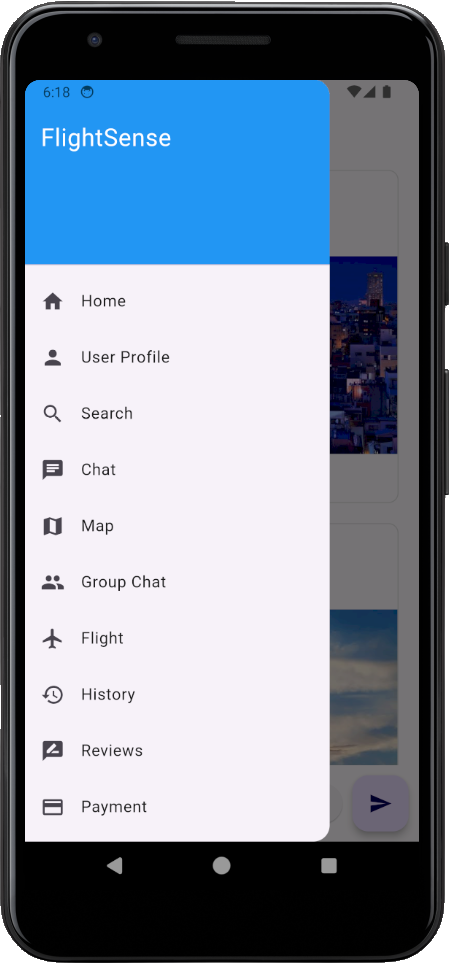
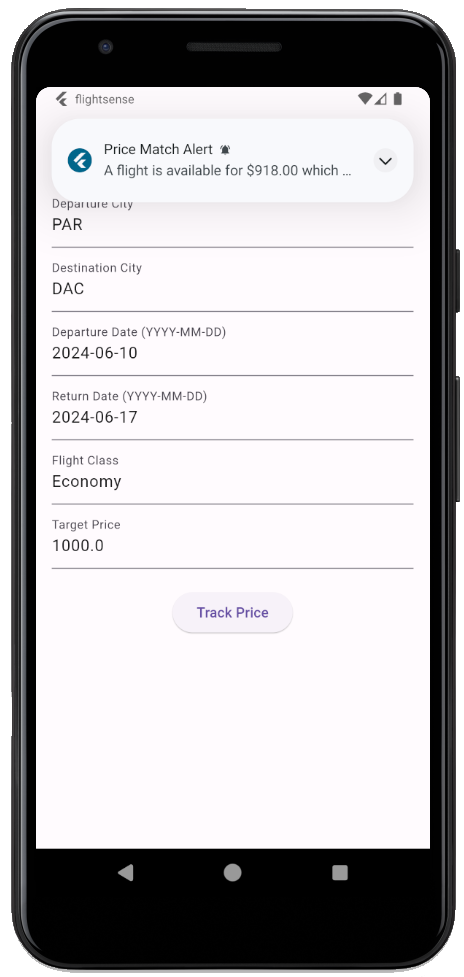
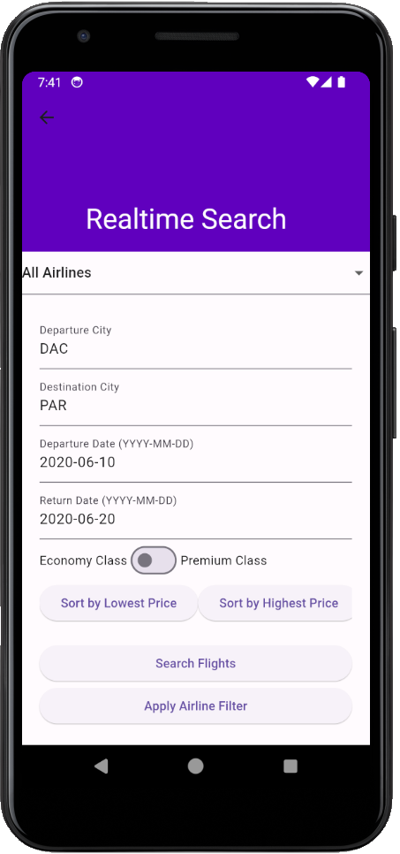
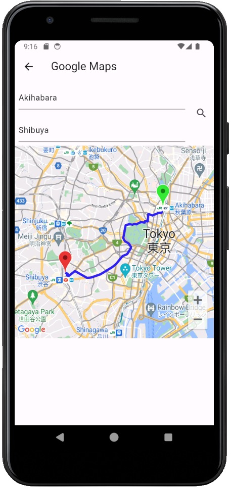
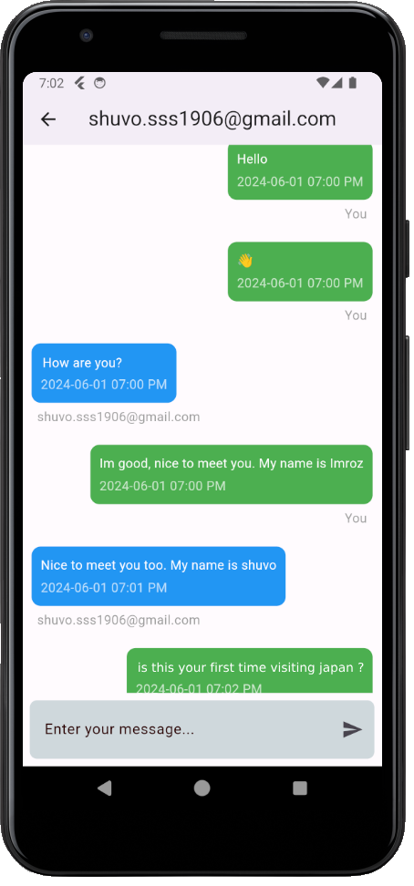

# FlightSense: A Travel Companion App

## Overview

**FlightSense** is a travel companion app designed to enhance your travel experience by connecting you with like-minded travelers, tracking flight prices, and offering helpful notifications. The app integrates a social community where you can share tips and experiences, track flight details, and even make bookings for your next adventure. Whether you're flying for business or leisure, **FlightSense** makes travel easier, more affordable, and more social!

---

## Key Features

### 1. **Social Community**
   - **Connect** with travelers from around the world and share your travel experiences.
   - **Make new friends** by following other users, instant messaging, and commenting on posts.

### 2. **Newsfeed**
   - Stay updated with the latest travel stories, news, and tips.
   - **Follow** your favorite travelers or destinations to receive personalized updates.
   - **Like**, **comment**, and engage with posts to share your thoughts and experiences.
   - **Upload images** to your posts in the feed to make your updates more engaging.

### 3. **Instant Messaging**
   - **Chat** in real-time with other users to discuss travel plans, share recommendations, or simply connect with fellow travelers.

### 4. **User Profiles**
   - Create and customize your **user profile** with your travel preferences and past journeys.
   - Share your **travel photos**, **reviews**, and **destinations visited**.
   - Track your **travel history** and plan your future adventures.

### 5. **Price Tracking & Notifications**
   - Track **flight prices** and receive real-time notifications when prices drop or when deals are available.
   - Set price alerts for specific destinations or airlines and never miss out on the best offers.
   - **Save money** by receiving notifications for special promotions and discounts.

### 6. **Flight Information**
   - Get **real-time flight tracking** and updates.
   - **View flight status** and get push notifications for any changes to your flight details.

### 7. **Likes & Comments on Posts**
   - **Like** posts in the newsfeed to show appreciation for great content.
   - Leave **comments** to engage with other travelers and share your thoughts.

### 8. **Google Maps Integration**
   - Use **Google Maps** to navigate and explore destinations, restaurants, hotels, and local attractions.
   - Share your current location and explore nearby points of interest.

### 9. **SSLCommerz Payment Integration**
   - **Securely make payments** through SSLCommerz for booking flights, accommodations, and other travel services.
   - **Easy and safe transactions** ensure that your payment information is protected at all times.

---

## Screenshots

Here are some images showcasing the app's interface:

---

